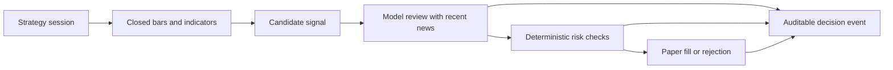

# Vibe Trading Agent

**A self-hosted workspace for AI-assisted strategy research, signal review, and paper trading.**

Build a strategy through chat, inspect candidate signals against market data and recent news, and review every model decision with deterministic risk checks and an auditable paper account.

[简体中文](README_ZH.md) | English

> **Status:** Early development. Observation and paper trading only. This project does not place live orders or provide investment advice.

## Why this project

Vibe Trading Agent brings the research loop into one local workspace: describe a strategy, follow its market, inspect candidate signals, and understand how each model review reached a paper-trading outcome. The model can review a candidate, but it cannot size a position, bypass risk controls, or call a broker.

## What works today

- **Persistent strategy sessions:** Create and revise strategies in natural language while keeping prompt and strategy versions.
- **Multi-market workspace:** Explore China equities, US equities, and crypto with candlestick charts and signal markers.
- **Candidate signal review:** Local code evaluates closed bars and indicators; a configured model reviews candidates with recent financial news and returns `BUY`, `SELL`, or `HOLD`.
- **Deterministic safeguards:** Cash, position, and China-equity T+1 checks run after every model decision.
- **Paper broker:** Track simulated cash, positions, orders, fills, fees, position limits, and idempotent signal handling.
- **Decision audit trail:** Inspect the strategy version, indicators, news context, model input/output, and paper execution associated with a chart signal.
- **Bring your own model:** DeepSeek, OpenAI, Claude, and OpenAI-compatible endpoints.
- **Self-hosted stack:** React + TypeScript frontend, FastAPI backend, and a local SQLite database by default.

Candidate signals are persisted and deduplicated by strategy version, instrument, interval, bar time, and direction, so signal history remains available in the session and audit timeline.

## Decision flow



News is subscribed, persisted, and deduplicated per session instrument. A candidate can include up to eight news items from the previous 48 hours as temporary context. News alone cannot trigger a trade. Model failures, timeouts, low confidence, and invalid output become `HOLD`.

## Quick start

Requirements: Python 3.10+ and Node.js 20+.

```sh
git clone https://github.com/leaout/vibe-trading-agent.git
cd vibe-trading-agent
python -m venv .venv
```

Install dependencies and prepare local configuration:

```sh
# macOS / Linux
.venv/bin/python -m pip install -r requirements-v2.txt
cp .env.v2.example .env
cp .env.local.example .env.local

# Windows PowerShell
.venv\Scripts\python.exe -m pip install -r requirements-v2.txt
Copy-Item .env.v2.example .env
Copy-Item .env.local.example .env.local
```

Install the frontend dependencies:

```sh
cd web_v2
npm install
```

Run the backend from the repository root:

```sh
# macOS / Linux
.venv/bin/python -m trading_v2

# Windows PowerShell
.venv\Scripts\python.exe -m trading_v2
```

In a second terminal, run the frontend:

```sh
cd web_v2
npm run dev
```

Open `http://127.0.0.1:5173`. The backend API is at `http://127.0.0.1:8010/api/v2`, with its OpenAPI page at `http://127.0.0.1:8010/docs`. Create the local administrator account on first visit.

## Configure a model

Add a model API key to `.env.local` on your machine. For example:

```dotenv
TRADING_V2_MODEL_ENABLED=true
TRADING_V2_MODEL_PROVIDER=deepseek
TRADING_V2_MODEL_NAME=deepseek-chat
TRADING_V2_MODEL_API_KEY_ENV=DEEPSEEK_API_KEY
DEEPSEEK_API_KEY=your-secret
```

Supported providers include `deepseek`, `openai`, `anthropic`, and `openai_compatible`. For an OpenAI-compatible endpoint, also set `TRADING_V2_MODEL_BASE_URL`. The UI can validate the connection without placing a trade.

Keep secrets in ignored `.env.local` or environment variables; never commit API keys, broker passwords, cookies, or session files. Tracked `.example` files should contain placeholders only.

## Data sources and limits

| Market | Current public data adapters | Example instrument |
| --- | --- | --- |
| China equities | Eastmoney, Sina | `cn_equity:XSHG:600519` |
| US equities | Yahoo Finance | `us_equity:XNAS:AAPL` |
| Crypto | Binance | `crypto:BINANCE:BTCUSDT` |

Public data services may have rate limits, regional restrictions, or limited history. Missing market data is reported explicitly; the UI does not substitute test data for live market data. QMT and live broker adapters are not used; the system never submits real orders.

The default database is `data/trading_v2.db`. Set `TRADING_V2_DATABASE_URL` to use PostgreSQL. Runtime settings use the `TRADING_V2_` environment prefix. See [.env.v2.example](.env.v2.example) and [the V2 documentation](docs/v2/ARCHITECTURE.md).

## Safety and scope

- The default execution mode is `observe`; the available broker is a system paper broker.
- The model never connects directly to a broker and cannot override deterministic risk checks.
- This is a software project for research and simulation, not financial advice or a promise of returns.
- Do not connect a brokerage account expecting live execution.

## Development

```sh
# Backend tests
python -m unittest discover -s test -p "test_trading_v2*.py" -v

# Frontend build
cd web_v2
npm run build
```

See [Architecture](docs/v2/ARCHITECTURE.md), [Trading lifecycle](docs/v2/TRADING_LIFECYCLE.md), [API](docs/v2/API.md), and [Data model](docs/v2/DATA_MODEL.md) for implementation details.

## Contributing and license

Bug reports and focused pull requests are welcome. Please include reproducible steps for issues and never attach secrets, account credentials, or private trading data.

**License:** No license has been declared yet. Public visibility does not grant permission to reuse, modify, or redistribute this code. A license should be selected before inviting external contributions or reuse.

---

For the Chinese version, see [README_ZH.md](README_ZH.md).
